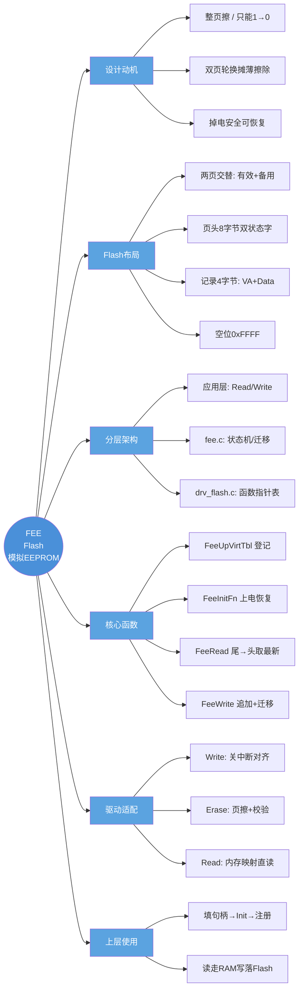

# FEE 轻量模拟EEPROM（单片机Flash模拟EEPROM）
> 配置设计思路：Flash布局、状态机、四个核心函数、底层驱动适配、上层注册使用全链路，以及代码中需要留意的要点

`fee.h`放在`Middlewares/fee/`文件夹下
`fee.c`放在`Middlewares/fee/`文件夹下

---

## 0. 文档框架总览（先看这里）

**一句话概览**：用两片 Flash 页 + 状态机 + 追加式记录，在只能"整页擦、按页写"的 Flash 上模拟出掉电安全的字节级 EEPROM；擦除被推迟到页满迁移时批量完成，以空间换寿命。

### 0.1 思维导图



### 0.2 分层调用链

```
┌─────────────────────────────────────────────────────┐
│ 应用层  App_StorageParamReg / FeeWrite / FeeRead     │  RAM镜像读，写才落Flash
├─────────────────────────────────────────────────────┤
│ 中间层  fee.c                                        │
│   状态机(FeeInitFn) · 追加写 · 页迁移(TransferPage)   │
├─────────────────────────────────────────────────────┤
│ 驱动层  drv_flash.c（函数指针表 FEE_FLASH_INFO_HANDLE_T）│
│   DrvFlashWrite / DrvFlashRead / DrvFlashErase       │
└─────────────────────────────────────────────────────┘
        ↓ 操作对象
Flash 末尾两页：[页0: 状态字×2 + 记录区][页1: 同构]
```

### 0.3 全文导航

| 想了解 | 看哪节 |
|--------|--------|
| 为什么要模拟、三大手段 | 设计动机（FEE三件套） |
| 页怎么划分、记录长什么样 | Flash布局（两页结构 / 页内布局 / 状态字 / 记录格式） |
| 句柄和数据结构 | 关键数据结构 |
| 四个核心函数怎么工作 | 四个核心函数（含页满迁移、掉电case） |
| 底层驱动怎么写、要注意什么 | 底层驱动适配（对齐 / 关中断 / 校验） |
| 上层怎么接入 | 上层注册与使用（启动顺序 / RAM镜像） |
| 一次完整写读的生命周期 | 上电运行时序 |
| 速查结论 | 实现要点整理 |

---

## 0.A 为什么要用FEE（设计动机）
单片机内部的Flash物理特性决定必须使用软件模拟。

| 特性     | EEPROM       | Flash                                  |
| -------- | ------------ | -------------------------------------- |
| 擦写单元 | 字节         | 页（一般1K~2K）                        |
| 写操作   | 字节直接写   | 只能`0→1`，不能`1→0`，**必须整页擦除** |
| 擦除前   | 无需预先擦除 | 写之前必须先整页擦除                   |

> ⚠️ 擦除会把一整页全部置为`0xFF`。

### FEE三件套解决上述问题
1. **双页轮换**：两个页，一页写满再切换，不能覆盖重写。两页交替使用，把擦除次数摊薄，把多次小合并成一次大擦，解决寿命问题。
2. **状态标记**：区分页状态，**不是直接写删除标记，而是擦除标记和合并**。多次写只对应1次擦除，**不擦除只是这个包装的自然结果**。
3. **掉电安全**：分步更新，目的不是让上层写操作原子，而是**把擦除推迟到后台**。

## 1. 分层架构
```
应用层：调用FeeRead/FeeWrite
中间层fee.c：实现FEE逻辑（页切换、状态流转、搬运、状态机恢复）
硬件驱动层：drv_flash.c 封装Flash操作
```
- **职责切分**：`fee.c`层不直接操作寄存器，**只调用底层函数指针**。真正执行读写擦由`drv_flash.c`完成。
- **解耦**：通过函数指针表，上层`fee.c`不绑定具体芯片，换MCU只换`drv_flash.c`，`fee`层不动。同时上层也通过这张表调用FEE，不直接依赖具体驱动函数。

### 4.4 三个核心不变量
这套实现任何时候都维护这三条：
1. **写优先**：两页中至多一页是`VALID_PAGE`。两页同时有效，非法状态，init会全格式化。
2. **任意时刻，RX_DATA页一定是旧页**。写两页同时有效，否则状态机的会话会格式化。
3. **添加只往`0xFFFF`空位写，从不覆盖已有记录。读时取**最后一条**命中记录 = 最新值。

## 2. Flash布局
### 2.1 两页结构
```c
// 页0起始地址
#define FEE_DRV_BASIC_PAGE0_START_ADDR
// 页1起始地址
#define FEE_DRV_BASIC_PAGE1_START_ADDR (PAGE0_ADDR + PAGE_SIZE)
// PAGE_SIZE 一般是 1K/2K，放在Flash末尾
```
两页大小相同，**交替使用**。当前一页是有效页+存数据，另一页是备用页。写满后有效数据搬到空页，角色互换。

### 2.2 页内布局
每一页**8字节页头**，之后是数据区。
```
页头（8字节）
├─状态字(4字节) | 状态字1(4字节) → 页头状态
└─记录头(4字节)+数据区 → 一条条记录，追加写，从偏移8开始往后排
```

### 2.3 状态头编码（断电恢复的根基）
```
0xFFFFFFF | ERASED(0xFFFF)        // 页被擦除
0x0000000 | RX_DATA(正在搬运中)   // 搬运源页
0x0000000 | VALID_PAGE(0x0000)   // 当前正常可用
```

> ✨为什么用两个状态字？用一个字也能区分，但两个字的好处：迁移时**先写状态字0（变为RX_DATA），最后才写状态字1（变为VALID_PAGE）**，形成两步过渡。这样断电时刻不同，状态不会错乱。这是分步原子化的关键。

```c
// 伪代码判断页状态
if(状态0 == ERASED && 状态1 == ERASED) return ERASED;
else if(状态0 == RX_DATA && 状态1 == ERASED) return RX_DATA;
else if(状态0 == RX_DATA && 状态1 == VALID_PAGE) return VALID_PAGE;
```

### 2.4 数据记录格式（写读配对的关键）
每次写一个变量，追加一条完整记录。**32位字 = `[VA<16位> | Data<16位>]`**（小端，低半字数据、高半字虚拟地址）。

- **16位变量编号（VA）**：虚拟地址。
- **16位数据**：存放变量值。

> ⚠️ `0xFF00`标记的作用：32位变量的第二个高半字固定`0xFF00`，代码里`(uint32_t)va<<16 | 0xFF00`。读时用它区分“这是32位变量的后半段”还是“另一条16位记录”。这要求16位变量的虚拟地址**禁止取0xFF00附近的值**，否则会误判。参考实现里这条是隐含约定，没有校验，使用时要留意。

### 2.5 空位识别
Flash擦完后的空位，数据区读到`0xFFFF`就是空位（可写记录结束）；遇到非`0xFFFF`就是已有记录。
> ⚠️ 因此**禁止取0xFFFF**（空位的高半字是0xFFFF，会和它混淆）。这也是源码注释里`0xFFFF value is prohibited`的来历。

## 3. 关键数据结构
```c
// 单个变量的注册信息
typedef struct
{
    uint16_t virtAddr; //虚拟地址VA（唯一标识一个变量，禁用0x0000，避开0xFF00段）
    uint16_t len;      //变量长度，1~65535
}FEE_VIRT_ITEM_T;

// FEE运行时句柄（每一个FEE实例一个）
typedef struct
{
    const FEE_FLASH_INFO_HANDLE_T *pFlashDrv;     //底层地址表
    const FEE_VIRT_ITEM_T *pVirtItemTbl;          //变量虚拟地址记录表
    uint16_t virtItemCnt;                          //变量数量

    //运行时内部状态，上层不要直接访问
    uint16_t virtTable[128]; //虚拟地址记录表
    uint8_t page0Valid;
    uint8_t page1Valid;
}FEE_HANDLE_T;

//底层flash驱动句柄，由drv_flash.c提供
typedef struct
{
    uint32_t (*DrvFlashWrite)(uint32_t dest, const uint8_t *src, uint32_t len);
    uint32_t (*DrvFlashRead)(uint32_t src, uint8_t *dest, uint32_t len);
    uint32_t (*DrvFlashErase)(uint32_t addr, uint32_t len);
    uint32_t FlashPageSize;
    uint32_t FlashBaseAddr;
}FEE_FLASH_INFO_HANDLE_T;
```

> 💡设计意图：**用函数指针表而非直接调用函数，是为了让fee层与具体Flash驱动解耦。换芯片只换drv_flash.c，fee层不动。同时上层也通过这张表调用FEE，不直接依赖具体驱动函数。**

## 4. 四个核心函数
### 5.1 `FeeUpVirtTbl` —登记虚拟地址表（最简单，先看）
```c
uint8_t FeeUpVirtTbl(FEE_HANDLE_T *hFee, uint16_t virtAddr, uint16_t len)
{
    //查找空位，Current自增
    uint16_t entry = hFee->virtTable[hFee->Current++];
    if (entry == 0xFFFF) {
        //取下一个空位
        entry = hFee->virtTable[hFee->Current++];
    }
    entry->virtAddr = virtAddr;
    entry->len = len;
    return 0;
}
```
> 使用方式：上层在`Init`之前，逐个变量把它填表存好。`Init`搬运、读遍历都靠这张表。

### 5.2 `FeeInitFn` —上电状态机恢复（最复杂、最重要）
> ✅职责：扫描两页状态，把任意断电后的中间态修复为「一页有效+一页空页」的确定状态。

**算法骨架（以Page0状态为主switch主分支）**
```c
switch(Page0Status, Page1Status)
{
case ERASED:
    // Page0空，Page1正常，Page0备用
case VALID_PAGE:
    // Page0正常，Page1备用
case RX_DATA:
    // Page0是被搬运源，继续搬运
case PAGE_FULL:
    //页满，触发页迁移
default:
    //任何无法识别的状态，全格式化
}
```

> 把页标记为有效的写法（两步写，对应状态头编码）：
```c
data[0]=0xEEEEEEEE; //状态0
FlashWrite(页基址, &data, 4); //状态字0，此时变为RX_DATA
data[0]=0x00000000;
FlashWrite(页基址+4, &data,4); //状态字1，变为VALID_PAGE
```

**搬运循环的细节：**
遍历`VarIndex`，从旧页读取变量的`VarAddr,VarData,Len`；
如果`ReadStatus == OK`，没有读到，就跳过；读到就写到新页。

> ⚠️注意：实现搬运循环里有个`x`变量和“跳过已存在变量”的逻辑`if(VarIndex !=x)`，用来跳过新页里已经存在的变量避免重复写。这个`x`是最新读新偏移10的位置判断。逻辑比较绕且脆弱。每个`FeeInit`分支结束时，系统都要回到一页`VALID`一页`ERASED`。迁移过程被标记`RX_DATA`旧页，擦旧页多步。每步之间断电都会落到上面某个中间态，重新启动。这就是**掉电安全的本质**。

### 5.3 `FeeRead` —读变量（从尾到头扫描）
```c
uint16_t FeeRead(FEE_HANDLE_T *hFee, uint16_t virtAddr, uint8_t *pData, uint16_t len)
{
    //找有效页
    PageStart = (有效页号) * PAGE_SIZE;
    Address = PageStart + 2; //页头8字节，跳过
    FlashRead(&PageStatus, &AddressValue, 2);
    while(Address < PageSize)
    {
        //从尾到头扫描，读到匹配的VA就break，保证读到最新值
        FlashRead(Address-2, &dataBuf,2);
        if(匹配虚拟地址)
        {
            //取出数据，复制到pData
            return OK;
        }
        Address -=4; //回退一条记录
    }
    return NOT_FOUND;
}
```
> ⚠️要点：**从尾到头**。因为追加写越靠后越新，命中即break，保证读到最新值。所以步进是`-4`。读VA用2字节，读数据用2字节。
> 32位变量，需要连续两个记录，保证这个约束。该时候VA命中第一条，再`Address+=2`取高半字。这意味着**写32位变量时两条记录必须连续写入，中间不能被别的记录插入**。`FeeWrite`是连续写两个字的，保证了这个约束。

### 5.4 `FeeWrite` —写变量（追加写 +页满迁移）
入口`FeeWrite`，是个调度器：
1. 先尝试追加写
2. 如果页满，执行页迁移，再写

#### 5.4.1 `FindValidPage` —找页（读与写逻辑不同）
> 写操作：优先找`RX_DATA`页，迁移途中的目标页，才有才可写`VALID`页。

```c
switch(Operation)
{
case WRITE:
    //优先RX_DATA页，迁移中继续往新页写
case READ:
    //优先VALID_PAGE，读有效页
}
```
> ✨这是掉电安全关键细节：**迁移是分步的，若迁移中途又来一次写，必须写到正在接收数据的RX_DATA页，否则这次写的数据会在搬运结束后旧页被一起抹掉**。

#### 5.4.2 `AppendRecord` —追加写引擎（核心）
```c
//找到页内第一个空位
Address = PageStart + 8;
while(Address < PageSize)
{
    FlashRead(Address,&val,4);
    if(val == 0xFFFF) break; //找到空位
    Address +=4;
}
if(Address >= PageSize) return PAGE_FULL;

//把变量按记录格式，4字节对齐写入Flash
FlashWrite(Address,&recordWord,4);
return OK;
```
> ⚠️要点：扫描方向**从头往后找第一个空位**（与读的从尾到头配合）。
> 32位变量要连续写两个`uint16_t`；如果快到页尾放不下，返回页满。
> ✨真实的掉电case：**一个变量写两个字时，第一个字写成功，第二个字被覆盖（变量复用）。若第一个字写失败，第二个字写成功则会误读。**

#### 5.4.3 `TransferPage` —页迁移（GC/拷贝均衡 +断电安全核心）
> 把有效页所有变量完整拷贝到另一页；搬完翻转页标记，擦旧页。同时也实现“一页里面同一变量的多次历史记录，搬完只保留最新一条”。

```c
uint16_t TransferPage(FEE_HANDLE_T *hFee, uint16_t oldPageId, uint16_t newPageId)
{
    //1.新页初始标记 RX_DATA
    //2.遍历所有注册变量，逐个FeeRead读旧页最新值，AppendRecord写到新页
    //3.全部搬完后，把新页标记 VALID_PAGE
    //4.擦除旧页，标记ERASED
}
```

> ⚠️为什么搬到一半断电也能恢复：`Init`会识别`RX_DATA`状态，**从旧页重读最新值，继续搬运**。这要求此时仍是`VALID_PAGE`阶段。读和搬的顺序不能反。

> ✨搬运的隐含前提：阶段C用`FeeReadVar`从旧页读最新值，这要求旧页此时仍是`VALID_PAGE`(阶段D才擦)。读和搬顺序不能反。

## 6. 底层的三个驱动适配，由`DRV_FLASH_INFO_HANDLE_T`函数指针表提供
```c
typedef int (*DrvFlashWrite)(uint32_t dest, const uint8_t *src, uint32_t len);
typedef int (*DrvFlashRead)(uint32_t src, uint8_t *dest, uint32_t len);
typedef int (*DrvFlashErase)(uint32_t addr, uint32_t len);
```

> ⚠️签名不一致注意：上层传的`dest/len`是字节；但FEE调用时（写状态头）会强转`uint32_t*`，而`DrvFlashWrite`内部又转回`uint8_t*`传给硬件。
> ⚠️**Flash硬件要求：4字节对齐，字对齐编程（Flash Word Program）。但FEE传进来的dest/len任意。**

### 6.1 `DrvFlashWrite` —写Flash
> 算法：头部补齐、中间整字写、尾部补齐。
> 硬件要求：写Flash必须4字节对齐。如果起始地址不是4字节对齐，要做读改写补齐。

关键点：
1. **写Flash前必须关闭中断**，写完恢复。
2. Flash只能`1→0`，不能`0→1`；没擦除的位不能写1。
3. 满足这个假设：如果要改一小段已有数据的中间字节，Flash不会把不该写的字节变成0。所以`DrvFlashWrite`不是通用的“任意字节改写”函数，它假设目标区是擦除干净的状态。
4. **小中间量**：`disable_irq()`覆盖整个写过程。每写4字节一次Cortex‑M小节拍，这样写大块程序要一致。
5. **返回码不做写入后校验**。`DrvFlashWrite`是一个底层API，返回void；调用该状态寄存器、硬件超时，这个函数就失效了。对比读函数`DrvFlashRead`没有校验。
6. **只做擦除不做校验**。`DrvFlashErase`不是魔术，Flash物理只能`1→0`，必须先擦。调用前必须保证目标已擦除，否则结果是“原值 AND 新值”。这就是为何FEE要把擦除剥离。

### 6.2 `DrvFlashErase` —整页擦除 +校验
```c
uint32_t DrvFlashErase(uint32_t start, uint32_t len)
{
    //向上对齐页边界
    //循环逐页擦除
    //擦完回读校验，确认全部变成0xFFFF
}
```
> ⚠️擦除是破坏性的，且是失败（寿命到了），所以校验很有必要。写函数没有对应校验，是不一致。

### 6.3 `DrvFlashRead` —直接内存读
```c
uint32_t DrvFlashRead(uint32_t src, uint8_t *dest, uint32_t len)
{
    //Flash是内存映射，直接memcpy即可
}
```
> Flash读取就是直接读内存映射，不需要解锁，也不需要ramfunc。现实里有一段`len%4`整字读的优化，但`#if0`注释掉了，当前用逐字节读，简单但慢。

> ⚠️注意点：Flash不需要关中断（读不阻塞总线），但读的地址必须有效（在Flash范围内）。

### 6.4 驱动层注册
```c
const FEE_FLASH_INFO_HANDLE_T DrvFlashInfoHandle = {
    .DrvFlashWrite = DrvFlashWrite,
    .DrvFlashRead = DrvFlashRead,
    .DrvFlashErase = DrvFlashErase,
    .FlashPageSize = PAGE_SIZE,
    .FlashBaseAddr = FEE_STORE_BASE
};
```

## 7. 上层注册与使用（完整调用链）
### 7.1 系统启动顺序（main）
```c
//1.定义FEE实例、变量表
FEE_HANDLE_T hFee;
const FEE_VIRT_ITEM_T virtItemTbl[] = {
    {.virtAddr=0x1001, .len=4},
    {.virtAddr=0x1002, .len=2},
};

//2.填充FEE句柄
hFee.pFlashDrv = &DrvFlashInfoHandle;
hFee.pVirtItemTbl = virtItemTbl;
hFee.virtItemCnt = sizeof(virtItemTbl)/sizeof(FEE_VIRT_ITEM_T);

//3.FEE初始化，做上电恢复
FeeInit(&hFee);

//4.注册参数（内部调用FeeUpVirtTbl，首次读）
App_StorageParamInit(&hFee);
```

> ✨注意：`App_StorageParamInit`必须在`FeeInit`之后。因为注册时会调用`FeeRead`读值。`Init`不先读就得不到正确数据。`main`里`Init`在前，注册在后。

每个持久化参数做一次注册，内部完成“填虚拟地址表 +首次读值 +恢复出厂默认”。

```c
void HAL_Storage_SettingReg(FEE_HANDLE_T *hFee, uint16_t virtAddr, uint16_t len, void *ramVal, cb_restore_factory cb)
{
    //1.调用FeeUpVirtTbl登记
    //2.FeeRead读取Flash的值
    //3.读不到就调用cb恢复出厂默认，写到ramVal
    //4.读到就把Flash值复制到ramVal
}
```

> ⚠️几个关键点：
> - 虚拟地址VA是**上层自己维护**，去做逻辑映射。要避开0x0000，避开0xFF00段。
> - `Storage`的真正**RAM镜像**：注册时就把值读到RAM。`FeeWrite`只是写Flash，**运行时优先读RAM副本，不必每次都读Flash**。这是FEE常见用法：**Flash只写时更新，读走RAM**。

### 7.2 运行时读写示例
```c
//写：RAM变量更新，调用FeeWrite落Flash
FeeWrite(&hFee, virtAddr, (uint8_t *)&ramVar, len);

//读：优先读RAM副本，不从Flash读
//如果需要强制从Flash读取再调用FeeRead
```

## 8. 上电运行时序
### 8.1 `FeeInit`流程
1. 底层驱动初始化
2. `FeeUpVirtTbl`，把全部变量注册进虚拟地址表
3. `FeeInitFn`：扫描两页，做断电恢复，保证一页有效一页空页

### 8.2 运行时序（以VA=0x0001，Data=0x12345678，32位为例）
1. 初始两页都擦除，`Init`格式化一页为`VALID_PAGE`
2. 第一次`FeeWrite`，记录追加写到页0
3. 反复写同一个变量，**不断追加新记录到老页尾部**
4. 页满，触发页迁移：把所有变量最新值拷贝到页1；页1标记有效；擦除页0
5. 此后写就往页1写，下次满再切回页0

> ⚠️中间断电任意时刻，上电`FeeInit`都可以恢复。

## 9. 实现要点整理
### 9.1 架构与可移植要点
- Flash页大小、起始地址放在`FEE_FLASH_INFO_HANDLE_T`，不在代码硬编码。
- 变量表、虚拟地址由上层注册，`fee.c`不写死变量。
- 所有Flash操作全部抽象到`drv_flash.c`，fee层完全不碰寄存器。

### 9.2 页头状态字
```
0xFFFF_FFFF → ERASED 已擦除
0x0000_FFFF → RX_DATA 正在搬运（源页）
0x0000_0000 → VALID_PAGE 当前有效页
```
> 两个状态字分步写，保证断电中间态可识别。

### 9.3 记录格式再回顾
- 每条记录4字节：`[高半字VA][低半字data]`
- 16位变量占用1条记录；32位变量占用连续两条记录。
- 读的时候**从页尾往页头扫描**，遇到第一个匹配VA就是最新值。
- 写的时候**从页头往后找第一个0xFFFF空位**追加写入。

### 9.4 掉电安全核心点
1. **迁移不原地改写旧页**：先把新页标记为`RX_DATA`，全部拷贝完成才改为`VALID_PAGE`，最后才擦旧页。
2. **写永远追加，绝不覆盖已有记录**。
3. **页迁移过程中断电，下次上电`FeeInit`识别`RX_DATA`，继续完成搬运**。
4. 禁止虚拟地址取`0x0000`、`0xFFFF`，避开`0xFF00`附近区间，防止和记录标记混淆。

### 9.5 寿命与擦写
多次小修改，合并为一次页擦除。变量重复写，只是不断追加记录；页满才触发一次完整拷贝+一次擦除。**把擦除次数显著摊薄，延长Flash寿命。**

> 缺点：会占用一部分Flash空间存历史记录；搬页会占用CPU时间，搬运期间不要做高实时性强阻塞。
